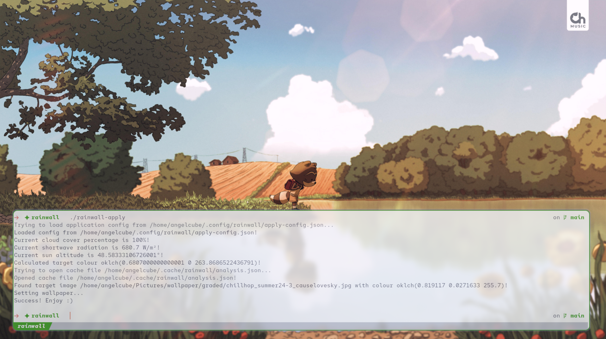

# rainwall

**rainwall is a program to set your wallpaper based on the weather outside.**

## but how?

This application uses ImageMagick to identify the dominant colour of an image using the Kmeans algorithm in the Oklch
colourspace. Once a dominant colour is found, a wallpaper is chosen by identifying the current shortwave radiation,
cloud cover, and sun angle, which correspond to lightness, chroma, and hue respectively.

## dependencies

- [ImageMagick](https://imagemagick.org)

## installing

First, install [ImageMagick](https://imagemagick.org) using your method of choice. Then download the binary from
[Releases on GitHub](https://github.com/weightedangelcube/rainwall/releases), or get it from
[JSR](https://jsr.io/@angelcube/rainwall/).

Alternatively, if you are using Arch Linux, you can use the PKGBUILD in the repository root to do both for you.

## usage

1. Give both `rainwall-analyze` and `rainwall-apply` an initial run to generate the config files, then edit the config
   files as needed. See below for configuration options.
   - Linux: `$XDG_CONFIG_HOME/rainwall` or `~/.config/rainwall`
   - Darwin (macOS/OSX): `~/Library/Preferences/rainwall`
   - Windows: `%LocalAppData%/rainwall`
2. Run `rainwall-analyze` to generate the index of image colours. This will take a while, be patient!
3. Run `rainwall-apply` to set your wallpaper! Enjoy!

## configuring

### `analyze-config.json`

| option                | typeof     | default                         | description                                                                                                                                                                                                                                                            |
| --------------------- | ---------- | ------------------------------- | ---------------------------------------------------------------------------------------------------------------------------------------------------------------------------------------------------------------------------------------------------------------------- |
| `imageDir`            | `string`   | `/home/<yourusername>/Pictures` | The directory where your image files are stored.                                                                                                                                                                                                                       |
| `preAnalysisCommands` | `string[]` | `[]`                            | An array of commands to perform before analysis begins. Examples include applying CLUTs, adjusting HSV, etc. All commands will be properly escaped. **Warning: commands are run directly with `eval`! Don't put anything potentially unsafe...** or do, we don't care. |

### `apply-config.json`

| option                  | typeof                           | default                            | description                                                                                                                                                        |
| ----------------------- | -------------------------------- | ---------------------------------- | ------------------------------------------------------------------------------------------------------------------------------------------------------------------ |
| `latitude`              | `number`                         | `0`                                | The latitude used to discover the weather outside.                                                                                                                 |
| `longitude`             | `number`                         | `0`                                | The longitude used to discover the weather outside.                                                                                                                |
| `weatherModel`          | `string`                         | `"best_match"`                     | The weather model to calculate cloud cover and shortwave radiation with. Find the options on the [Open-Meteo](https://open-meteo.com/en/docs) site.                |
| `lightnessRange`        | `{ start: number; end: number }` | `{ start: 0; end: 1 }`             | The range of lightness values to map shortwave radiation to. Use this if your images are all exceptionally light or dark, due to post-processing or other reasons. |
| `chromaRange`           | `{ start: number; end: number }` | `{ start: 0; end: 1 }`             | The range of chroma values to map cloud cover to. Use this if your images are all exceptionally saturated or desaturated, due to post-processing or other reasons. |
| `applyWallpaperCommand` | `string`                         | `hyprctl hyprpaper wallpaper , %s` | The command used to apply the wallpaper. See "applying the wallpaper" section below for more info.                                                                 |

## applying the wallpaper

Put `%s` where the image path would normally go.

### Linux

- GNOME (untested):
  - Light theme: `gsettings set org.gnome.desktop.background picture-uri file://%s`
  - Dark theme: `gsettings set org.gnome.desktop.background picture-uri-dark file://%s`
- KDE Plasma (untested):
  - `plasma-apply-wallpaperimage %s`
- awww (untested)
  - `awww img %s`
- swaybg (untested)
  - `swaybg -i %s`
- hyprpaper
  - `hyprctl hyprpaper wallpaper , %s`

### Darwin (macOS/OSX)

(untested, [source](https://discussions.apple.com/thread/254859103))

Launch Automator. Click New Document → Choose. From the "Files & Folders" library, drag and drop the "Set the Desktop
Picture" action to the right onto the larger workflow window. Save it somewhere accessible. Then, put this into the
config file: `automator -i "%s" /path/to/your.workflow`

### Windows

...who knows?

## compatibility

- Linux ✅
- Darwin (macOS/OSX) ❓
- Windows ❌
  - [ ] How does one set the wallpaper via CLI?
  - [ ] `apply/index.ts @ L80, analyze/analysis.ts @ L20`: equivalent of POSIX eval?
